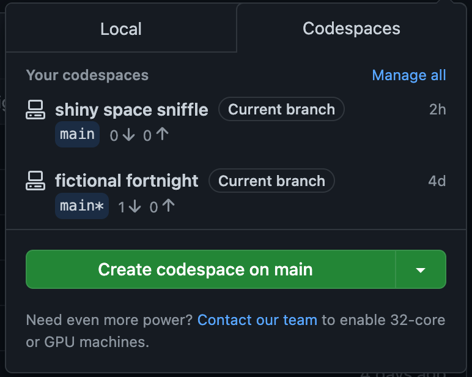

# Instructions to use vscode codespace

The critical files are:

* `./devcontainer/devcontainer.json`
* `setup.sh`
* `Dockerfile`

It comes with some suggested extensions. You may wish to add additional extensions such as markdown, etc.

Clone this entire repo, and re-create it to your own repo.

You should see this in the repo:



[Github introduction to dev containers](https://docs.github.com/en/codespaces/setting-up-your-project-for-codespaces/introduction-to-dev-containers)

[Vscode documents on developing inside a container](https://code.visualstudio.com/docs/devcontainers/containers)

Just click `Create codespace on main` and everything should be set up and ready to develop!

As of this writing, users gets 120 "compute hours" which is 60 hours for the smallest instance. If you apply for github student packet, you will get 180 "compute hours". This should be sufficient for most assignments.

## Locally

This instructions is to use docker.

You can create and run your docker images as follows:

For mac specific users, add this to the Makefile in main directory.

```Make
imagename=gt_env
db:
    docker build -t $(imagename) .
    docker run -it \
        --platform linux/amd64 \
        -v $(shell pwd)/:/root/ \
        -p 8888:8888 \
        $(imagename) 
```

For windows users, remove the `--platform linux/amd64`.

## Debugging example

Using `gdb` as debugging with vscode is pretty easy. 

Example script:

```c
#include <stdlib.h>
#include <stdio.h>

int main(int argc, char const *argv[])
{
    int arr[2];
    arr[3] = 100;
    return 0;
}
```

If you run:

```
gcc example.c -o example
./example
```

clearly a seg fault will happen.

In vscode, you can run the debugger by:

* Opening the command palette.
* And select `gdb start debugging`. You may want to consider adding breakpoints.
* You will be able to see all the variable explorers and can iterate though your variables.

The `gdb commands` can also be used in the `debug console`. You can monitor all threads and their values.

[More information on vscode debugging can be found here](https://code.visualstudio.com/docs/editor/debugging)